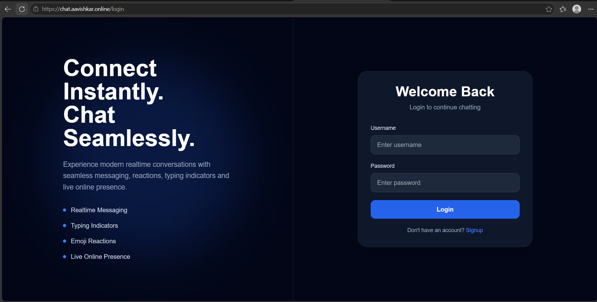
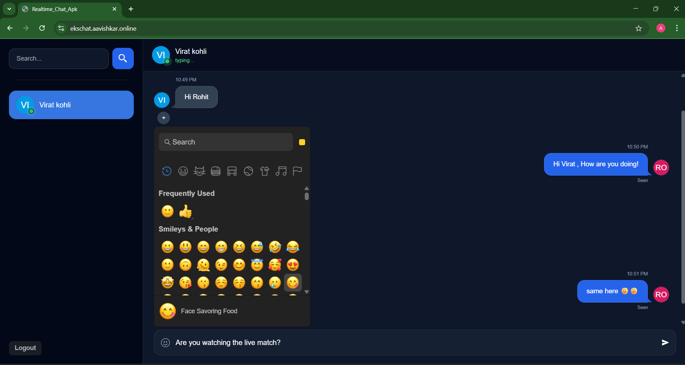

# Production-Grade Real-Time Chat Platform

## Live Demo

- https://chat.aavishkar.online

Realtime chat platform currently deployed on a lightweight k3s Kubernetes cluster.

Amazon EKS infrastructure is provisioned on-demand for deployment demonstrations, Kubernetes validation, and infrastructure testing.

EKS deployment screenshots and validation outputs are available throughout the documentation.

---

# Live Application

## k3s Deployment

Realtime chat application deployed on lightweight k3s Kubernetes cluster.

---

## Amazon EKS Deployment

Realtime chat application deployed on Amazon EKS with NGINX Ingress and TLS.

---

# Overview

Full-stack real-time chat platform built using React.js, Node.js, MongoDB, and Socket.IO, enabling instant messaging, typing indicators, online presence tracking, emoji reactions, and JWT-based authentication.

The project demonstrates production-grade application deployment across Amazon EKS and lightweight k3s Kubernetes environments using Terraform Infrastructure as Code, GitHub Actions CI/CD automation, HTTPS/TLS networking, and Prometheus/Grafana observability.

---

# Application Features

- Real-time messaging using Socket.IO
- JWT-based authentication and authorization
- Online/offline presence tracking
- Typing indicators
- Emoji reactions
- Persistent chat history using MongoDB
- Responsive React.js user interface
- REST API and WebSocket integration

---

# Key Highlights

## Application Engineering

- Real-time messaging platform built using React.js, Node.js, MongoDB, and Socket.IO
- JWT-based authentication and secure session management
- Online presence tracking and typing indicators
- Persistent chat history and user management
- Responsive user interface and real-time event handling

## Cloud & DevOps Engineering

- Hybrid Kubernetes deployments (Amazon EKS + k3s)
- Terraform-based Infrastructure as Code
- Multi-repository GitHub Actions CI/CD pipelines
- Dockerized frontend and backend services
- NGINX Ingress with HTTPS/TLS termination
- Prometheus + Grafana observability stack
- AWS ECR + DockerHub deployment workflows
- Kubernetes rolling deployments and health probes
- Environment-aware deployment automation
- Production-style ingress networking
- TLS-secured Kubernetes workloads

---

# Tech Stack

## Application Stack

- React.js
- Node.js
- Express.js
- MongoDB
- Socket.IO

## DevOps & Cloud

- Docker
- Kubernetes
- Terraform
- GitHub Actions
- Prometheus
- Grafana
- NGINX Ingress
- cert-manager

## AWS

- EKS
- EC2
- VPC
- IAM
- ECR
- Route53
- ACM
- Elastic Load Balancer

---

# System Architecture

## Hybrid Kubernetes Architecture

---

# CI/CD Workflow

---

# Monitoring Architecture

---

# Infrastructure Provisioning Architecture

---

# Repository Ecosystem

| Repository | Purpose | Access |
|------------|----------|---------|
| [Frontend Repository](https://github.com/aavishkar200603/realtime-chat-platform-frontend) | React frontend and Socket.IO client integration | Available on request |
| [Backend Repository](https://github.com/aavishkar200603/realtime-chat-platform-backend) | Node.js APIs, authentication, and real-time communication | Available on request |
| [Infrastructure Repository](https://github.com/aavishkar200603/realtime-chat-platform-Infra) | Terraform infrastructure, Kubernetes manifests, and deployment workflows | Available on request |
| [Architecture Repository](https://github.com/aavishkar200603/realtime-chat-platform-devops-architecture) | Architecture diagrams, observability setup, networking workflows, and documentation | Public |

---

# Repository Access

Some repositories remain private because they contain infrastructure automation and deployment configurations.

Access can be provided upon request for technical review or interview discussions.

---

# Documentation

- [Architecture Documentation](docs/ARCHITECTURE.md)
- [Deployment Documentation](docs/DEPLOYMENT.md)
- [Monitoring Documentation](docs/MONITORING.md)
- [Networking Documentation](docs/NETWORKING.md)

---

# Author

Aavishkar Pawar

- LinkedIn: https://www.linkedin.com/in/aavishkarpawar
- GitHub: https://github.com/aavishkar200603
