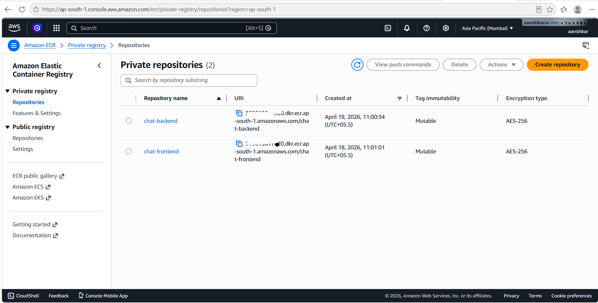

# Architecture Documentation

---

# Overview

This project demonstrates a production-style cloud-native real-time chat platform deployed across both Amazon EKS and lightweight k3s Kubernetes environments.

The architecture showcases Infrastructure as Code, hybrid Kubernetes deployment workflows, GitHub Actions CI/CD automation, observability, ingress-based traffic routing, and production-style networking.

---

# Hybrid Kubernetes Architecture


---

# Core Components

- React Frontend
- Node.js Backend API
- Socket.IO Real-Time Communication
- MongoDB
- Kubernetes Deployments
- NGINX Ingress Controller
- Prometheus
- Grafana

---

# Amazon EKS Architecture

## Components

- Amazon EKS
- Managed Node Groups
- AWS ECR
- Terraform
- Route53
- ACM TLS Certificates
- Elastic Load Balancer

---

# EKS Cluster Validation


---

# EKS Worker Nodes


---

# AWS Load Balancer


---

# AWS ECR Repositories



---

# k3s Architecture

## Components

- Lightweight k3s Cluster
- DockerHub
- GitHub Actions
- NGINX Reverse Proxy

---

# Request Flow

```text
User
   ↓
NGINX Ingress
   ↓
Frontend Service
   ↓
Backend API
   ↓
MongoDB
```