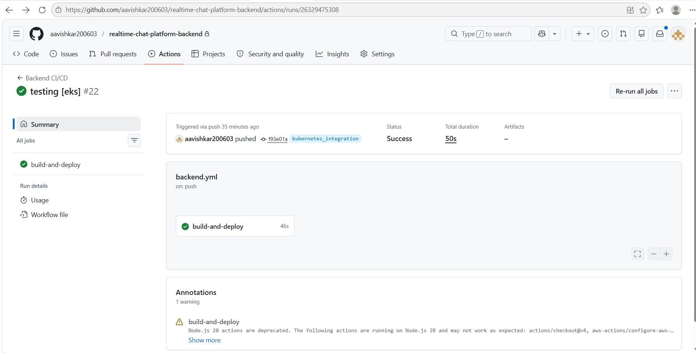
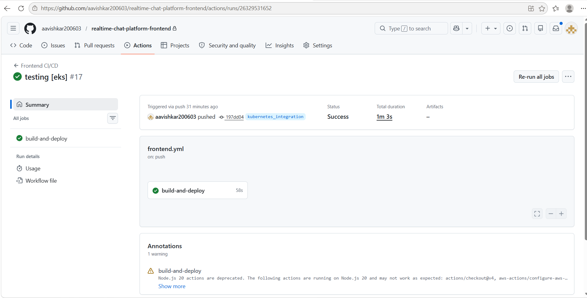
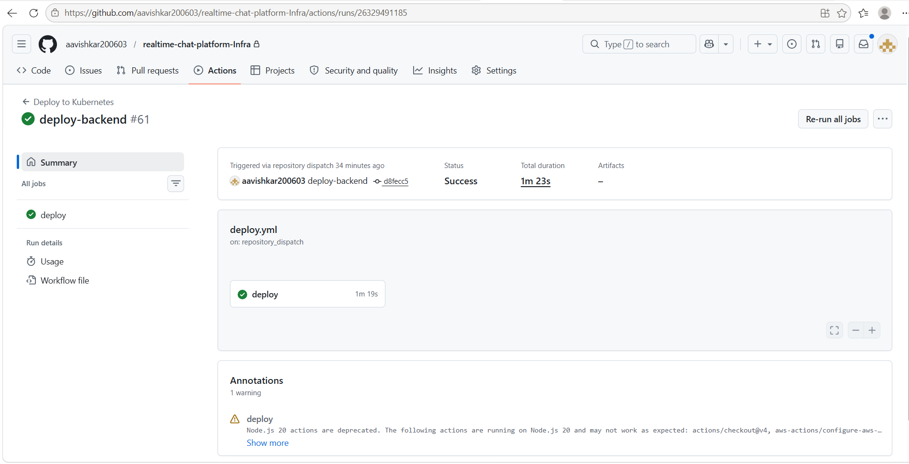
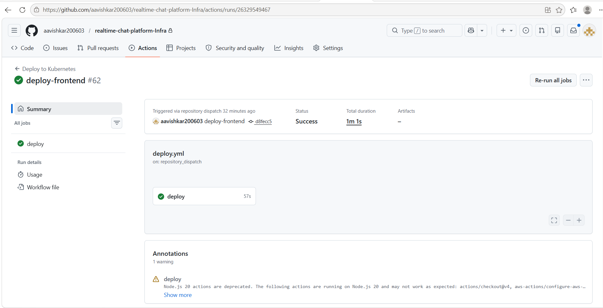
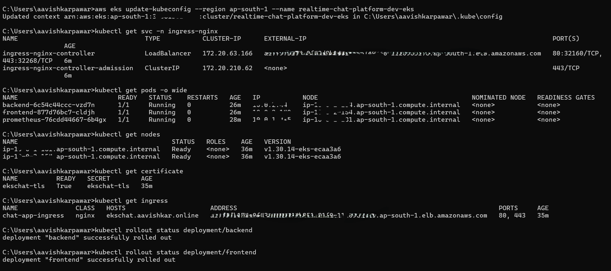
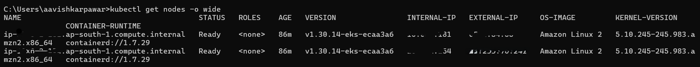

# Deployment Documentation

This document describes the CI/CD pipelines, container build workflows, registry integrations, and Kubernetes deployment automation used for the Real-Time Chat Platform.

---

# CI/CD Overview

This project uses GitHub Actions-based multi-repository CI/CD pipelines to automate container builds, image publishing, infrastructure deployments, and Kubernetes application rollouts across both Amazon EKS and k3s environments.

---

# Deployment Features

- Automated Docker image builds
- AWS ECR and DockerHub integration
- Multi-repository GitHub Actions workflows
- Kubernetes rolling deployments
- Environment-aware deployment pipelines
- Infrastructure repository dispatch automation
- Amazon EKS deployment support
- Lightweight k3s deployment support

---

# CI/CD Workflow


---

# Backend CI/CD Pipeline

The backend pipeline automates:

- Docker image builds
- AWS ECR image push
- DockerHub image push
- Kubernetes deployment updates
- Environment-aware deployments



---

# Frontend CI/CD Pipeline

The frontend pipeline automates:

- Frontend Docker image builds
- Registry pushes
- Kubernetes rollout updates



---

# Infrastructure Deployment Pipeline

The infrastructure deployment pipelines automate:

- Kubernetes manifest deployment
- Frontend deployment orchestration
- Backend deployment orchestration
- TLS setup
- Ingress deployment
- Rolling deployment updates
- Repository dispatch-based deployment automation

---

## Backend Infrastructure Deployment



---

## Frontend Infrastructure Deployment



---

# Kubernetes Deployment Validation



---

# Kubernetes Worker Nodes



---

# Deployment Workflow

```text
Developer
    │
    ▼
GitHub Repository
    │
    ▼
GitHub Actions CI/CD
    │
    ▼
Docker Image Build
    │
    ▼
AWS ECR / DockerHub
    │
    ▼
Infrastructure Repository Dispatch
    │
    ▼
Kubernetes Deployment Update
    │
    ▼
Amazon EKS / k3s Cluster
```
