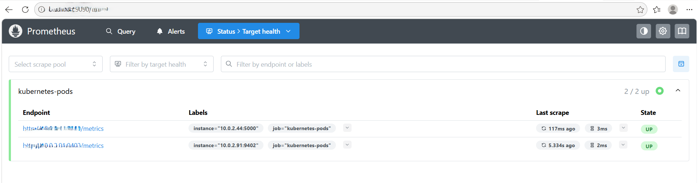
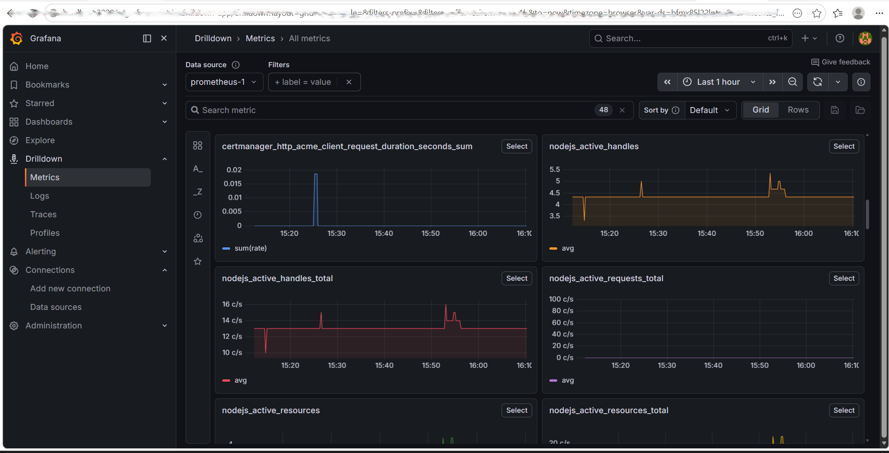

# Monitoring Documentation

---

# Overview

This project integrates Prometheus and Grafana for Kubernetes observability and real-time application monitoring.

---

# Monitoring Architecture


---

# Prometheus

Prometheus scrapes Kubernetes pods using annotations.

Example:

```yaml
annotations:
  prometheus.io/scrape: "true"
  prometheus.io/port: "5000"
  prometheus.io/path: "/metrics"
```

---

# Prometheus Target Health



---

# Grafana

Grafana dashboards visualize:

- Kubernetes cluster metrics
- Pod resource utilization
- Application health
- Real-time monitoring insights

---

# Grafana Dashboard

