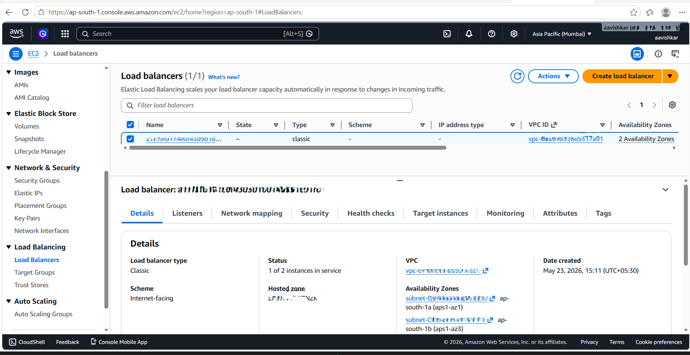

# Networking Documentation

---

# Overview

This project demonstrates production-style Kubernetes networking and ingress-based traffic management across Amazon EKS and k3s environments.

---

# Kubernetes Networking

Configured:

- ClusterIP Services
- NodePort Services
- LoadBalancer Services
- Internal DNS resolution
- Ingress-based routing

---

# NGINX Ingress

NGINX Ingress Controller handles:

- HTTP routing
- HTTPS termination
- Domain-based traffic routing
- Reverse proxying

---

# HTTPS/TLS

Implemented:

- cert-manager
- Let's Encrypt
- Automatic TLS certificate provisioning
- HTTPS enforcement

---

# Domain Integration

Configured:

- Route53 DNS
- Custom domain routing
- TLS-secured ingress traffic

---

# Kubernetes Networking Validation


---

# AWS Load Balancer



---

# Load Balancer Workflow

```text
User
   ↓
AWS Load Balancer
   ↓
NGINX Ingress Controller
   ↓
Kubernetes Services
   ↓
Pods
```